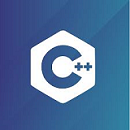

# C++-code


[](./LICENSE)

Created a repository for my C++ codes. These codes are my college assignments. The version of C++ used is C++ v14. The text editor used is VS-Code.

```
g++ <file-name>.cpp -o output
output.exe
```

# License

[The MIT License (MIT)](LICENSE)
